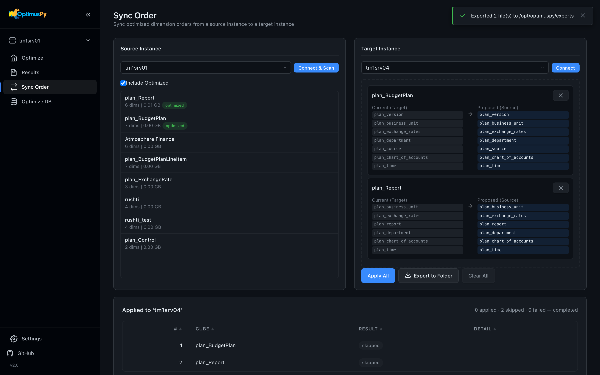

# PROD Promotion Workflow

End-to-end: optimize in DEV (or any production-like instance), export the results, apply to PROD. The recommended OptimusPy lifecycle.

## Why this workflow exists

OptimusPy is **never run in production**. The benchmarking process:

- Sets VMM / VMT to 1,000,000 (disables stargate caching during the run)
- Runs hundreds of `update_storage_dimension_order` calls (each rewrites the cube on disk)
- Runs queries / processes against the cube repeatedly

These are fine in a non-PROD environment with the same data and infrastructure. They're **not** OK in production. The PROD promotion workflow uses OptimusPy's results without re-running benchmarks against PROD.

## Step 1: Optimize in DEV

Run benchmarks on a production-like environment (DEV, UAT, PA Playground, anywhere with the same data shape):

```bash
optimuspy optimize sales_dev.json
```

Where `sales_dev.json` points at the DEV instance:

```json
{
  "instance": "tm1srv01_dev",
  "cube": "Sales",
  "views": ["Optimus_Daily_Drill", "Optimus_Monthly_Summary"],
  "executions": 5,
  "output": "xlsx"
}
```

The HTML report names the winning order. It's worth checking it makes sense, because sometimes the best order has surprising tradeoffs you want to validate by hand.

## Step 2: Export from Sync Order

Export the winning orders from the Sync Order page with **Export to Folder**, as described in [Taking an Order to Production](../guide/taking-an-order-to-production.md). Connect the source to `tm1srv01_dev`, where you ran the benchmark.



The export writes one `set` config per cube into `exports/`:

```text
exports/
├── plan_BudgetPlan.json
└── plan_Report.json
```

Each file's `instance` field is the target you had connected (or the source, if you hadn't connected a target); edit it if needed.

## Step 3: Apply to PROD

Two choices.

### Option A: From the UI

Apply the orders from the same Sync Order page with **Apply All**, as described in [Taking an Order to Production](../guide/taking-an-order-to-production.md#with-sync-order-ui). The job runs in the background; live progress on the Jobs page.

### Option B: Via CLI (recommended for CI/CD)

Edit each exported JSON's `instance` field to point at PROD, then loop:

```bash
for f in exports/*.json; do
  optimuspy set "$f" --config config/production.ini
done | tee deployment-$(date +%Y-%m-%d).log
```

Capture the log file. Each apply records RAM before and after, which is useful for change tickets.

## Step 4: Verify

After apply, open the **Optimize** page in the UI on PROD and tick **Include optimized**, so cubes whose storage order now differs from their visual order are listed too. Each cube's **Overview** tab shows its current storage order, which should now match what you applied. `optimuspy scan` does not help here: it lists only cubes whose storage order still matches their visual order.

## Rollback

Keep the previous orders in version control. If a rollback is needed, restore the prior exported files and re-run the loop. The CLI is idempotent: re-applying the same order is safe.
