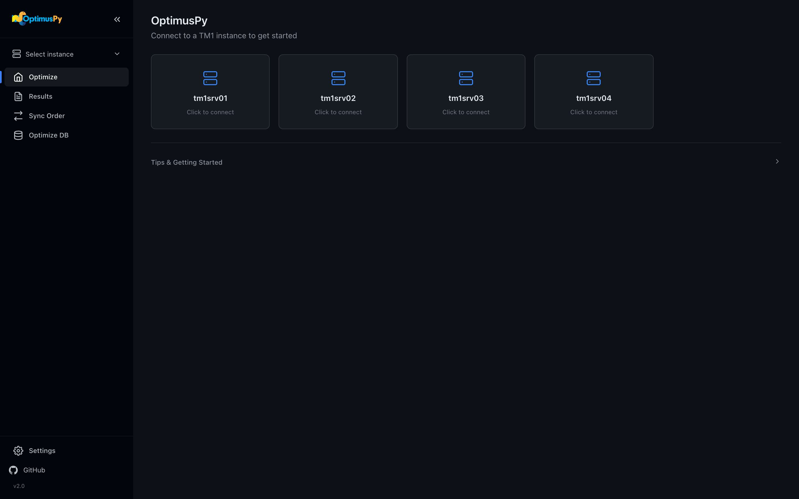

## Quick Start

Get from a fresh install to your first optimized cube in under 10 minutes.

[← Back to the landing page](https://cubewise-code.github.io/optimus-py/){ .back-link }

1. **Open the UI.** Double-click the executable, or run `optimuspy ui`. It opens at `http://127.0.0.1:8765`.
2. **Add your server.** On *Settings*, click *New Instance*, then add its address, port, user and password and click *Save*. See [TM1 Connection](tm1-connection.md) for every parameter.
3. **Pick a cube.** Choose the instance in the sidebar. The *Optimize* page lists cubes by memory; click one.
4. **Run it.** On *Configure*, keep *Greedy*, pick a view and click *Save & Start Optimization*. When it ends, open the HTML report on the cube's *Results* tab.

The full walkthrough, in the UI and on the command line, is in the User Guide: [Your First Optimization →](../guide/first-optimization.md)
