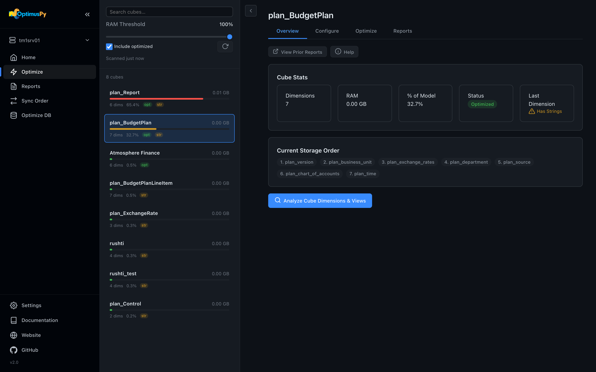
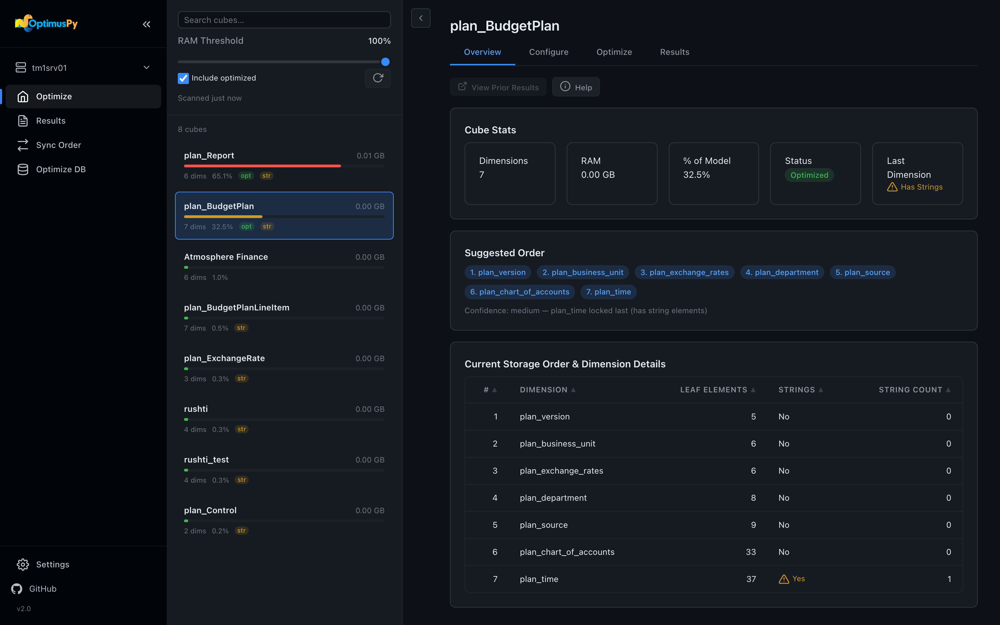

# Your First Optimization

The same single-cube run, first in the UI, then on the command line.

## In the UI

1. **Open the UI.** Double-click the executable, or run `optimuspy ui`. It opens at `http://127.0.0.1:8765`.
2. **Add your server.** On *Settings*, click *New Instance*, give it a name and click *Create*. The first instance you add creates `config/config.ini`. On the new instance's tab, use *Add Field* for the address, port, user and SSL fields, type the password under *Update Password*, then click *Save*. *Test Connection* checks the saved settings.

    

3. **Connect.** Choose the instance in the sidebar's instance selector. The first time, the UI asks for the password; leave it blank if config.ini already holds it. The UI keeps what you typed until you reload the page.
4. **Find a cube.** The *Optimize* page lists cubes by memory. The *RAM Threshold* slider limits the list to the cubes that make up that share of the instance's memory (60% by default); click the refresh button next to *Include optimized* to scan again after you move it. *opt* means the cube's storage order already differs from its visual order; those cubes are hidden until you tick *Include optimized*. *str* means the last dimension of the storage order has string elements, so it can't move.

    

5. **Look at the cube.** Click it. The *Overview* tab shows its current storage order, the leaf count of each dimension, and a suggested order.

    

6. **Configure the run.** On *Configure*, keep the mode on *Greedy*. Pick one or more views, set *Executions per permutation* (5 to 10 is sensible), and choose CSV or XLSX. Leave *Auto-apply best* off for a first run, so the cube ends in its original order.
7. **Start.** Click *Save & Start Optimization*. The *Optimize* tab shows the live log. *Stop* ends the run and puts the original order back.
8. **Read the report.** When the run ends, the cube's *Results* tab lists the report. Open the HTML file. See [Reading the Result](reading-the-result.md).

Every page of the UI is described under [Web UI](../ui/overview.md), starting with the [Optimize Page](../ui/optimize-page.md).

## On the command line

Describe the cube in a JSON file. `samples/optimize.json` is a starting point:

```json
{
  "instance": "tm1srv01",
  "cube": "Sales",
  "views": ["Optimus"],
  "executions": 10,
  "output": "csv",
  "fast": false,
  "update": false
}
```

1. **Configure the connection.** Copy `config/config.ini.example` to `config/config.ini` and add a section for your instance. To keep the password out of the file, pass it with `-p`. See [TM1 Connection](../getting-started/tm1-connection.md).
2. **Optional: find candidates.** `optimuspy scan --instance tm1srv01 --output configs/` lists the largest cubes and writes a starter JSON for each.
3. **Run.** `optimuspy optimize sales.json`. Add `-v` to log why any order was skipped.
4. **If it stops.** Run the same command again: it continues from its checkpoint. `--no-resume` starts over. See [Checkpoints & Resume](../advanced/checkpoints-resume.md).
5. **Find the report.** `results/<instance>/<instance>_<cube>_<timestamp>.html`, next to a CSV or XLSX of the same name, in the folder you ran from. The log is `logs/optimuspy.log` in the install folder: the executable's folder for the bundle, the repository root for a clone.

Every command and flag is in the [CLI Reference](../advanced/cli-reference.md), and every JSON field in the [JSON Config Reference](../advanced/json-config-reference.md).

**Next:** [What Happens During a Run →](during-a-run.md)
