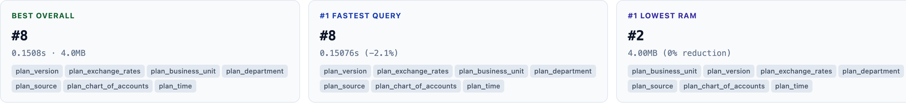
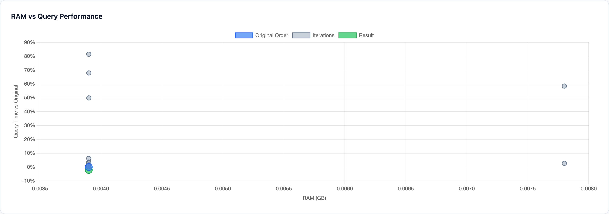

# Reading the Result

What the report tells you, and where the cube ends up.

- **Best Overall** is the recommended order. OptimusPy checks the orders in the order they were tested, starting with the original. The first one within 1% of the best on memory, and on query and TI time where you gave views or processes, wins. The 1% is of the gap between the best and the worst order tested. If none qualifies, it tries again at 2.5%, then 5%. If there is still none, the original order is put back and the log asks you to pick one from the results. So the original order wins whenever nothing is clearly better.

    

- **The chart** plots every tested order: memory across, query time relative to the original up. Lower and further left is better. With processes and no views, the vertical axis is TI time relative to the original instead. With neither, it shows the memory saving, so higher is better.

    

- **"Not measurable".** If no tested order changed memory at all, the log warns that the cube wasn't measurable: the orders can't be told apart on memory, so pick one yourself from the timings.
- **Where the cube ends up.** With auto-apply (`"update": true`; the UI writes `"auto_apply": true`, which means the same) the best order is applied. Otherwise the original is put back and you apply the winner yourself, with `set` or Sync Order. See [Taking an Order to Production](taking-an-order-to-production.md).

Every part of the report is described on the [Reports Page](../ui/reports-page.md#reading-the-single-cube-report), and the selection rule on [How the best order is chosen](../concepts/how-it-works.md#how-the-best-order-is-chosen).

**Next:** [Taking an Order to Production →](taking-an-order-to-production.md)
