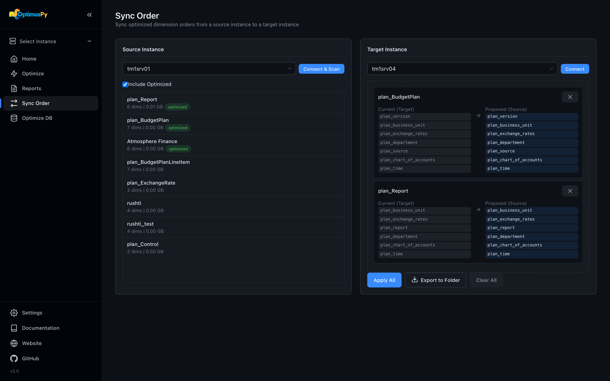

# Taking an Order to Production

Once a run on DEV has found a better order, apply it to PROD without benchmarking there.

## With Sync Order (UI)

1. On *Sync Order*, choose the source instance (DEV) and click *Connect & Scan*.
2. Choose the target instance (PROD) and click *Connect*. Drag cubes from the source list onto the target. Each card shows the target's current order next to the proposed one.

    

3. Click *Apply All*. A cube already in the proposed order is skipped. Or click *Export to Folder* to write one JSON per cube to `exports/` instead.

See the [Sync Order Page](../ui/sync-order-page.md) for every control on the page.

## With set (command line)

Each exported file is a `set` config. On the production machine, run `optimuspy set exports/Sales.json`. `set` refuses an order that moves the locked slot and changes nothing in that case. See [Set Mode](../modes/set-mode.md) and [Exporting & Importing Orders](../advanced/exporting-importing-orders.md).

For a worked example with a deployment loop and a rollback, see [PROD Promotion Workflow](../examples/prod-promotion-workflow.md).

That's the single-cube journey. If you'd rather shrink a whole instance first and then benchmark only the cubes that matter, the last page covers that.

**Next:** [Optimize DB Step by Step →](optimize-db-step-by-step.md)
