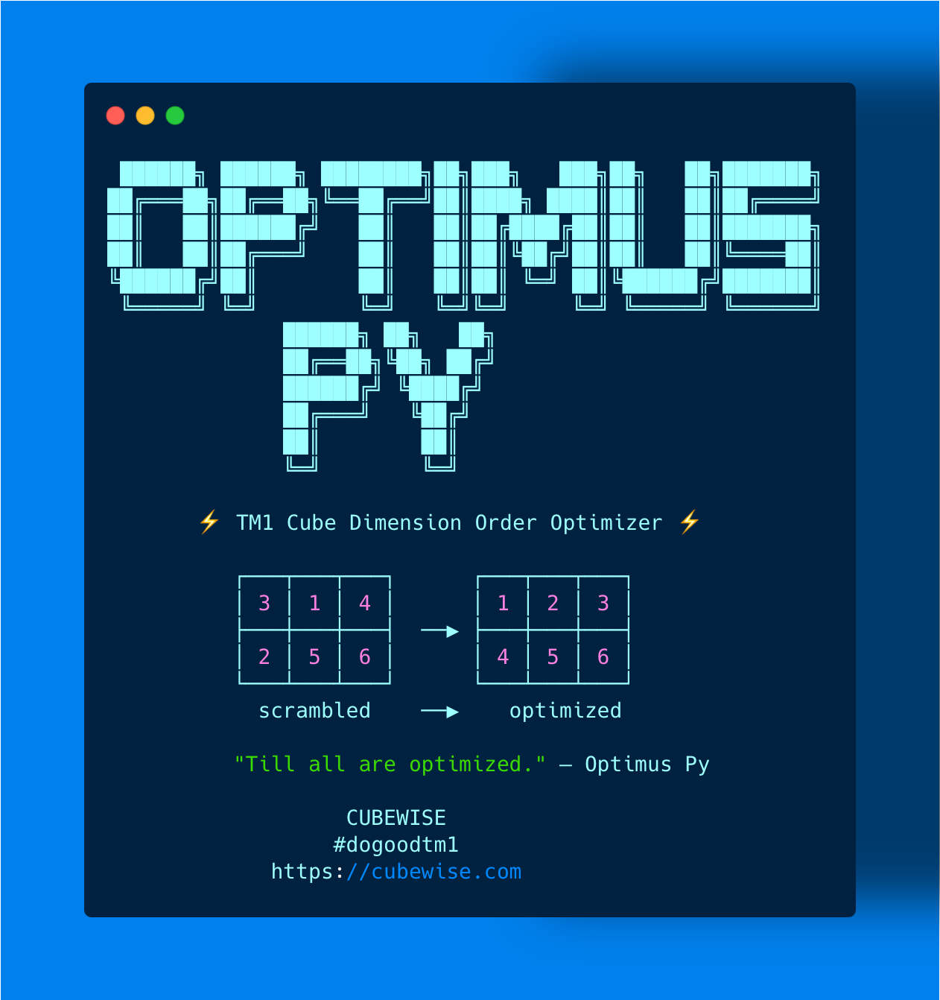

  

The goal of OptimusPy is to find a better storage dimension order for your IBM TM1 / Planning Analytics cubes, so they use less memory and answer queries faster. It gets there by measuring real reorders on your server (RAM, query time and TI time), rather than guessing, and it can apply the winner for you. You can drive it from a local web UI or from the command line, and every run ends with an interactive HTML report.

Supported versions: TM1 v11 and v12 (PAoC/PAaaS).

[:material-web: Website](https://cubewise-code.github.io/optimus-py/){ .md-button }
[:material-github: GitHub](https://github.com/cubewise-code/optimus-py){ .md-button }

-   :material-book-open-variant:{ .lg .middle } __User Guide__

    ---

    New to OptimusPy? We'd recommend starting here, because it walks you through the whole journey: picking a mode, running your first optimization, reading the result and taking it to production.

    [:octicons-arrow-right-24: Choose a mode](guide/choose-a-mode.md)

-   :material-rocket-launch-outline:{ .lg .middle } __Quick Start__

    ---

    Already know what you want? Install OptimusPy and get your first result in about 10 minutes.

    [:octicons-arrow-right-24: Get started](getting-started/quick-start.md)

-   :material-monitor-dashboard:{ .lg .middle } __Web UI__

    ---

    A tour of the local browser interface (Optimize, Results, Sync Order, Optimize DB, Settings and the Jobs list), so you know where everything lives before your first run.

    [:octicons-arrow-right-24: UI overview](ui/overview.md)

-   :material-tune-vertical:{ .lg .middle } __Modes__

    ---

    Optimize, Set, Scan, Optimize DB, Predefined, Position and Dimension. Each one answers a different question, and these pages help you pick the right one for yours.

    [:octicons-arrow-right-24: Explore modes](modes/optimize-mode.md)

-   :material-console-line:{ .lg .middle } __CLI Reference__

    ---

    Every command, flag and JSON config field in one place, handy once you start scripting runs.

    [:octicons-arrow-right-24: Command reference](advanced/cli-reference.md)

