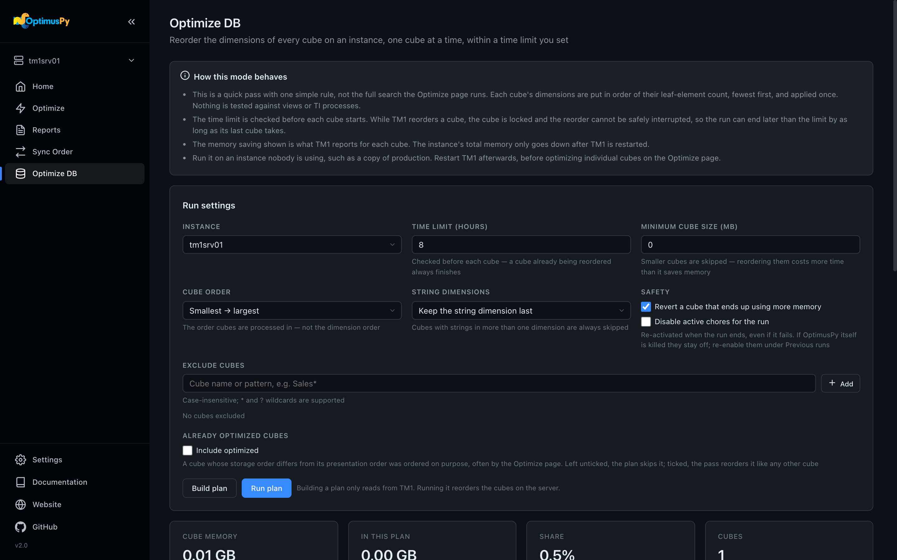
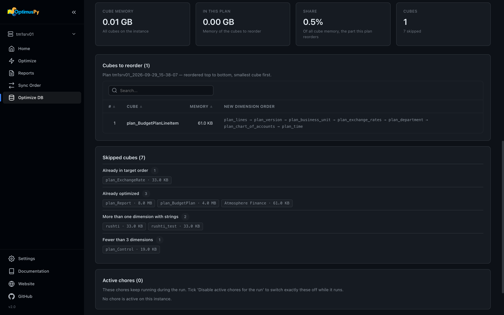

# Optimize DB Page

Reorder every cube on an instance by leaf-element count, fewest first, within a time limit, without benchmarking anything. The page drives the same pass as `optimuspy optimize-db` on the command line: you build a plan, review it, run it, and come back to it if it was interrupted.

For what the pass does and why, see [Optimize DB Mode](../modes/optimize-db.md). For a run start to finish, see [Optimize DB Step by Step](../guide/optimize-db-step-by-step.md).

## Run settings

The card at the top sets the same options as the instructions JSON:

| Setting | Default | JSON field |
|---|---|---|
| **Instance** | (pick one) | `instance` |
| **Time limit (hours)** | 8 | `time_limit_hours` |
| **Minimum cube size (MB)** | 10 | `min_cube_mb` |
| **Cube order**: *Smallest → largest* or *Largest → smallest* | Smallest → largest | `order` |
| **String dimensions**: *Skip any cube with string elements* or *Keep the string dimension last* | Skip any | `string_policy` |
| **Safety**: *Revert a cube that ends up using more memory* | on | `revert_on_regression` |
| **Safety**: *Disable active chores for the run* | off | `disable_active_chores` |
| **Exclude cubes** | none | `exclude_cubes` |
| **Already optimized cubes**: *Include optimized* | off | `include_optimized` |

**Cube order** is the order the cubes are processed in, not the dimension order; that is always leaf-element count, fewest first. **Exclude cubes** takes one name or pattern at a time (case-insensitive, `*` and `?` wildcards, e.g. `Sales*`); press Enter to add each one.

A cube is **already optimized** when its storage order differs from its presentation order, which usually means someone chose that order on purpose, often with the [Optimize page](optimize-page.md). The plan skips these cubes by default, so this pass doesn't overwrite a measured order with its one simple rule. Tick **Include optimized** to reorder them like any other cube.

The first time you pick an instance after the page loads, the **Connect to Instance** dialog asks for its password. Leave it blank if `config.ini` stores it.

## Build plan

**Build plan** only reads from TM1: no reorder, no chore change. It writes the plan file to `results/<instance>/` and shows it on the page:

- Stat cards with the memory of all cubes on the instance, the memory of the cubes to reorder, and the share of all cube memory the plan covers. That share is the number to read first, because it tells you how much of the model the run will and won't touch.
- **Cubes to reorder**: one row per cube, in the order the run takes them, with its memory and its new dimension order.
- **Skipped cubes**: every cube the plan leaves alone, with the reason (excluded, below the minimum size, already optimized, string elements, already in the target order, and so on). See [Skip reasons](../modes/optimize-db.md#skip-reasons).
- **Active chores**: the chores that are active right now. This is a snapshot for you to review; the run reads the live state again when it starts.

If no cube qualifies, the page says so and there's nothing to run.

## Run plan

**Run plan** asks for confirmation, then runs the plan exactly as shown; nothing is re-planned. If you change a run setting after building the plan, the button refuses until you build it again, so what runs is always what you reviewed.

While it runs, the **Run progress** card shows one row per cube with its status, RAM change and time taken, plus the elapsed time and how much of the time limit is left. **Stop after current cube** ends the run before the next cube; the cube being reordered always finishes, because TM1 can't safely abort a reorder. The page finds the running job on the server, so it keeps following it after a reload or from a second tab, and the sidebar's Activity Monitor takes you back to it from any page.

When the run ends, the summary shows the cubes reordered and reverted and the **expected saving**. One thing to bear in mind is that this saving is visible only after a TM1 restart, because the memory a reorder frees stays with the process until then. See [After the run](../modes/optimize-db.md#after-the-run).

## Previous runs

The table at the bottom lists every Optimize DB run recorded for the instance, newest first, with its status and outcome. A run that didn't complete (stopped on the time limit, cancelled, failed) has a **Resume** button, which does what `--resume <plan-id>` does: it continues in the time that was left of the original limit. A run that left chores disabled shows a **Chores still disabled** warning with a **Re-enable chores** button, which does what `--restore-chores <plan-id>` does.

Every run has a **Report** button, which opens the run's HTML report in a new tab. A run whose report file is missing gets it built from its plan and run files first. See [Reading the Optimize DB report](reports-page.md#reading-the-optimize-db-report).

The plan, run and report files themselves are in `results/<instance>/`, named `optdb_plan_<plan-id>.json`, `optdb_run_<plan-id>.json` and `optdb_report_<plan-id>.html`, and the [Reports page](reports-page.md) lists them under *Optimize DB (all cubes)*. See [Artifacts](../modes/optimize-db.md#artifacts).
