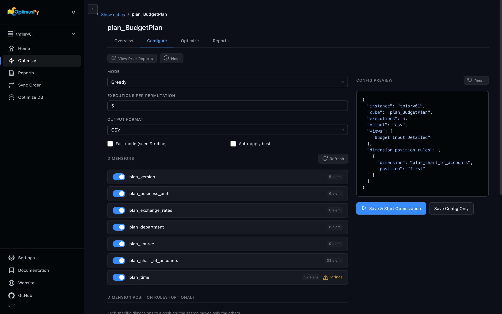
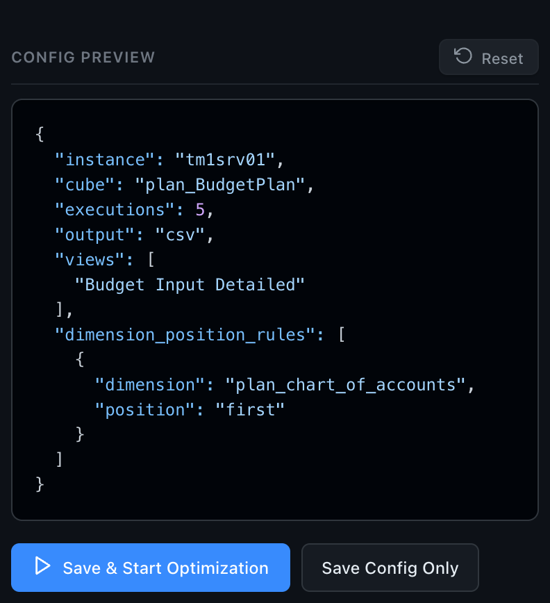

# Optimize Page

The Optimize page is the heart of OptimusPy. Connect to an instance, scan for candidate cubes, and configure and run a benchmark for the cube you pick.

## Connecting & scanning

1. Pick an instance from the sidebar **Instance Switcher**. The UI runs a connection test and a fast model scan.
2. Adjust the **RAM Threshold** slider to control how aggressively cubes are filtered (default: 60% of total model RAM).
3. Tick **Include optimized** to also list cubes that already have a custom storage order.

The scan reads from the TM1py Metrics service (`cube_memory_used`), which works the same on v11 and v12, in a single fast round-trip. Results are cached locally for 24 hours; click the refresh button next to **Include optimized** to scan again.

## Cube workspace

Click any cube in the list to open its workspace. Four tabs:

### Overview

Cube stats and the current storage order. Click **Analyze Cube Dimensions & Views** to load the rest (it's a separate step because it reads every dimension): a dimension table with leaf element counts and string-element flags, and a **Suggested Order**, which is the dimensions ordered by leaf-element count, fewest first, with a string-bearing dimension kept last. The Configure tab loads the same data, so if you've been there first the table is already filled in.

### Configure

Pick the optimization mode and tune parameters. Available modes:

- **Greedy**: the full outside-in benchmark (default)
- **Predefined**: test a known list of orders
- **Position**: optimize a single position
- **Dimension**: optimize a single dimension

For each mode you can:

- Pick **views** to benchmark query speed
- Pick **TI processes** to benchmark ETL time (with parameter overrides)
- Set **executions** (how many times each query/process runs; the median counts)
- Choose the **output format**, CSV or Excel (XLSX)
- Tick **Fast mode (seed & refine)** for the shorter greedy fold
- Tick **Auto-apply best** to write the best order back to the cube
- Set **dimensions to exclude** (kept fixed during the search)
- Set **dimension position rules** (lock specific dims to specific positions). **Add Rule** asks for a dimension and a **Lock to Position**: *First*, *Last*, or a *Position* numbered from 1 like the Overview table. The config counts from 0, so *Position 3* is written as `2`. One rule per dimension and one per position.
- List **orders to ignore** (orders the greedy search should skip)

**Reset** puts the form back to its defaults.

The **Config Preview** beside the form shows the generated JSON config (it's identical to what the CLI consumes). **Save & Start Optimization** saves it to the cube configs folder, `cube-configs/` by default, starts the job in the background and opens the Optimize tab. **Save Config Only** saves it without starting, and the toast shows the file's full path. The [Folders card](settings-page.md#folders) on Settings changes the folder.

### Optimize

The job's status, elapsed time and live log, with a **Stop** button while it runs. A run that fails shows as **Failed**, with the error in the log. The tab finds the cube's job on the server, so it also shows a job started in another browser tab or before a reload, replaying its log from the start.

### Reports

The cube's runs on the connected instance, newest first: each run's **Open report**, and its CSV or XLSX as a small link beside it. **View Prior Reports**, above the tabs, opens the [Reports page](reports-page.md) with the cube's group open; it's available once the cube has a report.

## Stopping a job

Click **Stop** on the cube's Optimize tab (the sidebar Activity Monitor takes you there). OptimusPy cancels the TM1 threads the job's session is running (a query, or a reorder in flight), puts the cube back in its original order (best-effort), restores the original VMM/VMT on TM1 v11, and keeps the checkpoint, so re-running the same config resumes. See [Checkpoints & Resume](../advanced/checkpoints-resume.md).

## What happens next

The report and its data land on the [Reports page](reports-page.md). The [Jobs page](jobs-page.md) lists every job since the UI server started.
