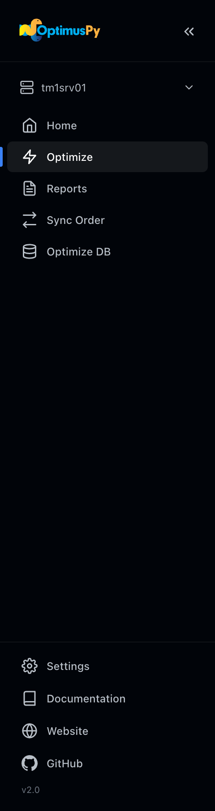

<div class="optimus-banner" markdown>
# UI Overview

OptimusPy ships with a local web UI that wraps the entire scan → configure → optimize → apply workflow.

[← Back to the landing page](https://cubewise-code.github.io/optimus-py/){ .back-link }
</div>

For a first run from start to finish, see the User Guide: [Your First Optimization](../guide/first-optimization.md).

It's a single-page app served by a lightweight Python HTTP server, with no extra dependencies and nothing in the cloud.

## Launching

```bash
python -m optimuspy.ui
```

Your default browser opens automatically at `http://127.0.0.1:8765`. The server runs in the foreground; `Ctrl+C` stops it.

### Custom port

```bash
python -m optimuspy.ui --port 9000
```

### Custom config file

```bash
python -m optimuspy.ui --config config/production.ini
```

A file passed with `--config` is treated as belonging to another tool, so Settings shows it read-only; see [Read-only config.ini](settings-page.md#read-only-configini).

### From the executable

Double-click `optimuspy.exe`, or run it from a command prompt:

```cmd
optimuspy.exe ui
optimuspy.exe ui --port 8800 --config D:\tm1\config.ini
```

With Python installed, `optimuspy ui` does the same.

The executable ships without a `config.ini`. The first instance you add in [Settings](settings-page.md#new-instance) creates `config/config.ini` next to it.

## Sidebar navigation



| Item | Purpose |
|---|---|
| **Instance switcher** | Pick the active TM1 connection. It is the instance the Optimize page works on; Sync Order and Optimize DB pick their own. |
| **Optimize** | Scan candidates and run benchmarks for one or many cubes. |
| **Results** | Browse generated HTML / CSV / XLSX reports. |
| **Sync Order** | Promote dimension orders from a source instance to a target instance. |
| **Optimize DB** | Reorder every cube on an instance by leaf-element count, fewest first, within a time limit. See the [Optimize DB Page](optimize-db-page.md). |
| **Settings** | At the bottom of the sidebar: manage TM1 connections, theme, and local cache. |

The sidebar collapses to icons on narrow screens, and folds away behind a menu button on a phone. While a job is running, the **Activity Monitor** appears below the page links and names it; click it to open the job's page. The [Jobs page](jobs-page.md) has no sidebar item: open it at `#/jobs`, for example `http://127.0.0.1:8765/#/jobs`.

## Passwords

The first time you use an instance after the page loads (from the instance switcher, Sync Order or Optimize DB), a **Connect to Instance** dialog asks for its password. Leave it blank if `config.ini` stores the password. The password you type is kept by the page only, so a reload asks again. A refused login shows TM1's answer, for example `Connection failed: TM1 returned 401 Unauthorized`.

## Live progress (SSE)

Long-running jobs stream progress over Server-Sent Events, so you see per-iteration updates without refreshing the page, in any modern browser. An optimization or an Optimize DB run is not tied to the tab that started it: open its page after a reload or in a second tab and the log is replayed from the start. A sync is the exception, because its per-cube results live only in the tab that started it.

## Caching

Scan results and per-cube intelligence (leaf counts, suggested orders) are cached in your browser's `localStorage`:

- Scan cache → 24-hour expiry
- Intelligence cache → 7-day expiry

If you change something on the TM1 server (e.g., delete string elements, rename a dimension), use **Settings → Clear Cache** to force a fresh fetch.

## Pages at a glance

In sidebar order:

- **[Optimize](optimize-page.md)**: the main workflow, scan, configure, run.
- **[Results](results-page.md)**: generated HTML reports and raw data.
- **[Sync Order](sync-order-page.md)**: drag-and-drop cross-instance promotion.
- **[Optimize DB](optimize-db-page.md)**: reorder every cube on an instance within a time limit.
- **[Settings](settings-page.md)**: connections, theme, cache and saved configs.
- **[Jobs](jobs-page.md)**: every job since the UI server started (no sidebar item).
