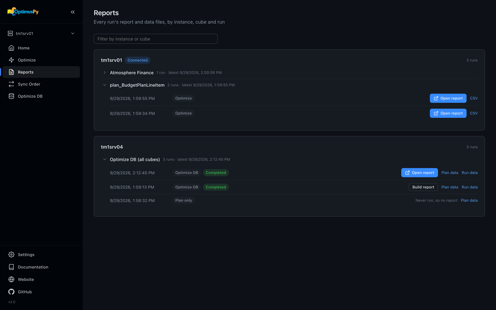
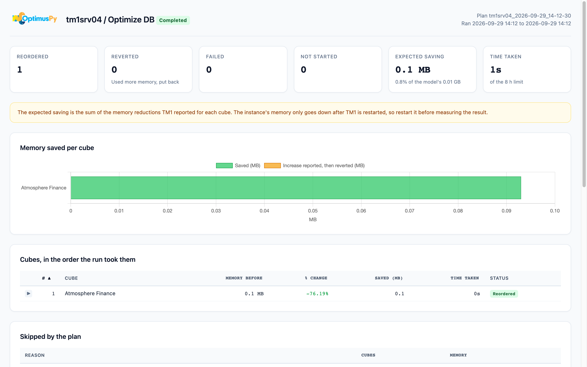

# Reports Page

Every run writes its files to the local `results/` directory, in a folder per instance. The Reports page lists them by instance, then by cube, then by run, so the run you're after is easy to spot. Each run has one HTML report, which is the main thing to open, and its data files beside it.



## How runs are grouped

The page has one card per instance. The instance you're connected to comes first, then the others by name. Files from before results were kept in a folder per instance are listed under **(no instance)**.

Inside an instance card:

- **One group per cube**, by name. Click a group to open it. Each row is one Optimize run of that cube, newest first.
- **Optimize DB (all cubes)**. An Optimize DB run covers the whole instance, so it's listed next to the cubes, not inside one.
- **Other files**, when there are any: files in the instance's folder that belong to no run, so nothing on disk is hidden. Checkpoint files, which exist only to resume a run, are not listed.

Each run row shows when it ran and what kind of run it was: **Optimize**, **Optimize DB** (with the run's status, in the words the Optimize DB page uses), or **Plan only**. **Open report** opens the HTML report in a new tab. The small links after it open the run's data files:

| Kind of run | Report | Data files |
|---|---|---|
| **Optimize** | `<instance>_<cube>_<timestamp>.html` | **CSV** or **XLSX**, with the same name |
| **Optimize DB** | `optdb_report_<plan-id>.html` | **Plan data** (`optdb_plan_<plan-id>.json`) and **Run data** (`optdb_run_<plan-id>.json`) |
| **Plan only** | none: the plan was built and never run | **Plan data** |

The JSON files open as readable JSON in the browser.

Type in **Filter by instance or cube** to narrow the list. An instance whose name matches is shown whole. Otherwise only the cubes whose names match are shown, already opened.

## Build report

An Optimize DB run writes its report when it ends. A run whose report file is missing shows **Build report** in place of **Open report**. It builds the report from the run's plan and run files, without connecting to TM1, and opens it. While a run is still in progress, its report can't be built yet: it's written when the run ends.

## Reports for one cube

On the [Optimize page](optimize-page.md), a cube's **Reports** tab lists that cube's runs on the connected instance, in the same rows as this page. **View Prior Reports** opens this page with that cube's group open.

## Reading the single-cube report

Every successful Optimize run generates one HTML report. Depending on the `output` field in your config, you also get a CSV or an XLSX with the raw data.

| Extension | Purpose |
|---|---|
| `.html` | Interactive report with podium + scatter chart |
| `.csv` | One row per tested permutation, all metrics, after four `#` comment lines and a blank line (skip them if you import the file) |
| `.xlsx` | Same rows as the CSV on one sheet, with the original and best orders shaded |

Below the summary cards and the recommended dimension order, the report has three parts:

### Scatter chart (Chart.js)

Every tested permutation plotted on RAM (X) vs query time relative to the original order (Y). Hover any dot for the full order. The original order is marked in a contrasting color. One thing to bear in mind is that the chart library loads from a CDN, so this part of the report needs internet access; without it, the chart area says so, and the podium and the table are self-contained.


### Podium

Cards side by side, above the table: **Best Overall**, then **#1 Fastest Query** (when views were benchmarked), **#1 Fastest Process** (when processes were) and **#1 Lowest RAM**. Click a card to highlight its row in the table. If no order qualified as Best Overall, there's no podium, and the log asks you to pick from the results.


### Detail table

Every permutation, sortable. Use this when you want to dig into the raw numbers: query time and process time with their ratio to the original, RAM and its reduction, reorder time, and the dimension order.

### The CSV and XLSX

CSVs open in Excel / Numbers / your editor of choice. An XLSX file has one sheet: a short header (instance, cube, generation time), then one row per tested permutation.

## Reading the Optimize DB report

The Optimize DB report has the same look as the single-cube report, with its own content, because an Optimize DB run benchmarks nothing: the only measure of each cube is the change in memory TM1 reports for its reorder.



From top to bottom:

1. **Header**: the instance, the plan id, when the run started and ended, and its status: Completed, Stopped — time limit, Stopped — cancelled, Failed or Running.
2. **Stat cards**: the cubes reordered, reverted, failed and not started; the **expected saving** (in GB, or in MB when it's under a gigabyte) and its share of the model's memory when the plan was built; and the time taken against the time limit.
3. **A note** that the saving is what TM1 reported for each cube, and that the instance's memory only goes down after TM1 is restarted. See [After the run](../modes/optimize-db.md#after-the-run).
4. **Memory saved per cube**: a bar chart, largest saving first. A cube that was reverted shows the increase TM1 reported in another color, which is why it was put back. Like the single-cube chart, it needs internet access for its library.
5. **Cubes, in the order the run took them**: memory before, % change, memory saved, time taken and status, with the columns sortable. Click a row to see the cube's original and new dimension orders. An error, or a failure to put a cube back, shows under the cube's name. A `% change` marked **recovered** was measured from a memory read after a dropped connection took TM1's own answer with it.
6. **Skipped by the plan**: the cubes the plan left out, grouped by reason, with the count and memory per reason. See [Skip reasons](../modes/optimize-db.md#skip-reasons).
7. **Chores**: the chores the run disabled and whether they were re-enabled, or that chores were left running.
8. **Run settings**: the options the plan was built with.

## Where results live on disk

```
results/
├── tm1srv01/
│   ├── tm1srv01_Sales_2026-04-01_15-23-44.html
│   ├── tm1srv01_Sales_2026-04-01_15-23-44.csv
│   └── tm1srv01_Budget_2026-04-01_16-02-11.html
└── tm1srv04/
    ├── optdb_plan_tm1srv04_2026-04-02_22-00-00.json
    ├── optdb_run_tm1srv04_2026-04-02_22-00-00.json
    └── optdb_report_tm1srv04_2026-04-02_22-00-00.html
```

Files are named with the time the run started, so they sort chronologically. They're never auto-deleted, so clean up old runs by hand.

## Checkpoint files

Files named `checkpoint_*.json` in `results/` are mid-run state snapshots used by the resume feature. They're not listed on the Reports page. See [Checkpoints & Resume](../advanced/checkpoints-resume.md).
