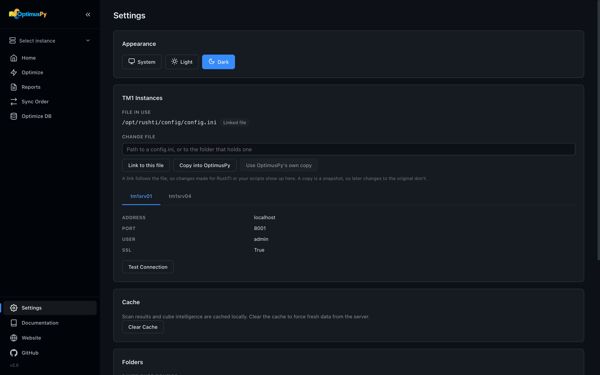
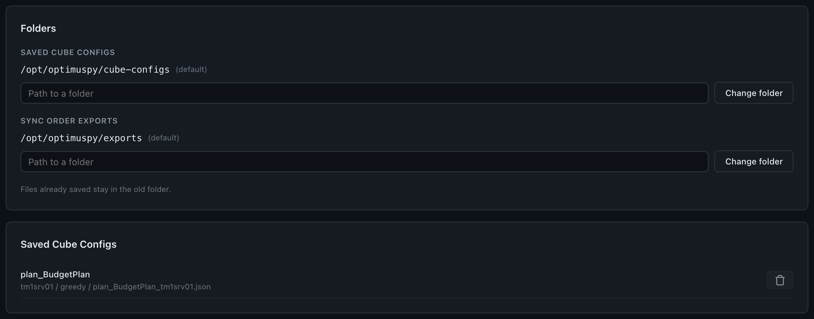

# Settings Page

Choose which `config.ini` OptimusPy reads, test your TM1 connections, and manage the browser theme, the local cache and saved cube configs. Settings doesn't edit a `config.ini`: you maintain the file where it lives, in a text editor or in the tool it belongs to.

## Appearance

Theme switcher: **System** (follows OS preference), **Light**, or **Dark**. Persists in `localStorage`.

## TM1 Instances

The card shows, from top to bottom:

1. **File in use.** The full path of the `config.ini` OptimusPy is reading, and where that choice came from:
    - *OptimusPy's own copy*: `config/config.ini`;
    - *Linked file*: a file linked from this page;
    - *Set by --config at launch*: the file given with `--config`.
2. **Change file.** Type or paste the path to a `config.ini`, or to the folder that holds one. Quotes around the path, which Windows *Copy as path* adds, are removed. Then pick one of two options:
    - **Link to this file** reads the file where it is, so changes made for RushTI or your scripts show up here.
    - **Copy into OptimusPy** puts a snapshot in `config/config.ini`, so later changes to the original don't. If `config/config.ini` already exists, a confirmation asks before replacing it.

    When a linked file is in use and `config/config.ini` exists, **Use OptimusPy's own copy** switches back to it. This part is hidden when `--config` chose the file: restart without the flag to change it here.
3. **One tab per instance**, with its fields read-only. Secrets such as the password are never shown.

The choice is saved in [`config/settings.ini`](../getting-started/settings.md), so the command line uses the same file: `optimuspy optimize x.json` without `--config` reads the file you picked here. See [TM1 Connection](../getting-started/tm1-connection.md#which-configini-is-read) for the order in which the choices apply.

After you switch files, the UI disconnects, forgets the passwords typed in the Connect dialog and clears the [cache](#cache), because the same instance name can point at a different server in the new file.

If the file in use is missing or doesn't parse, the card says so in place of the tabs. If there's no `config.ini` yet, it tells you to point to one above, or to create `config/config.ini` from `config/config.ini.example`.

### Test Connection

Connects to the TM1 server with the instance's fields from `config.ini`, and with the password typed in the Connect dialog if there is one. Returns the server name and cube count on success, or a clear error toast on failure.

## Cache

Two caches are stored in your browser's `localStorage`:

| Cache | Key prefix | TTL |
|---|---|---|
| Scan results | `op-scan-` | 24 hours |
| Cube intelligence (dimension metadata) | `op-intel-` | 7 days |

Click **Clear Cache** to wipe both, plus the in-memory state. Use this after server-side changes (deleted string elements, renamed dimensions, fresh data load) to force a clean fetch.

## Folders

Where the UI writes JSON files, one row each:

- **Saved cube configs**: where the Optimize page saves a cube config. `cube-configs/` by default.
- **Sync Order exports**: where Sync Order's *Export to Folder* writes. `exports/` by default.

Each row shows the folder in use, marked *(default)* when it's the default. Type a path and click **Change folder** to use another one; it's created at once, so a folder that can't be written is reported here rather than at the first save. **Use default**, shown when the folder isn't the default, goes back to it. The choice is saved in [`config/settings.ini`](../getting-started/settings.md) as `cube_configs_dir` and `exports_dir`.

Files already saved stay in the old folder. After the cube configs folder changes, the list below shows the files in the new one.

## Saved Cube Configs

Lists every JSON config saved in the cube configs folder from the Optimize workflow. Each row shows the cube, then its instance, mode (`greedy` or `predefined`) and file name, with a trash button to delete it. Useful for cleaning up experiments.
