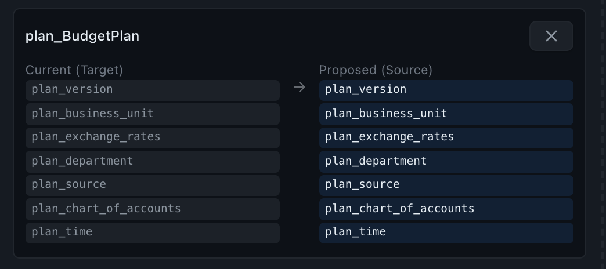

# Sync Order Page

Promote optimized dimension orders from a non-production instance (where you ran benchmarks) to production (where you didn't). Drag cubes from a Source panel on the left to a Target panel on the right, then either apply directly or export CLI-compatible JSON files.


## Source panel

1. Pick a **source instance** from the dropdown and click **Connect & Scan**.
2. The full cube list appears. **Include Optimized** is ticked by default, because the cubes you want to promote are usually the ones that already have a custom storage order; untick it to hide them.
3. Drag any cube row from the source list onto the Target panel's drop zone.

The drag order matters: the order in which you drop cubes into the Target panel becomes the order in which they're applied.

## Target panel

1. Pick a **target instance** and click **Connect**. (You don't have to connect the target to drag; connecting fills in the current-vs-proposed preview, and **Apply All** asks you to connect first if you click it before.)
2. Each dropped cube renders as a card showing:
    - **Current (Target)**: the cube's current storage order on the target instance
    - **Proposed (Source)**: the storage order from the source instance, with changes highlighted



3. Cubes that don't exist on the target are flagged with a warning and excluded from Apply. **Clear All** empties the target panel.

## Apply All

Asks for confirmation, naming how many cubes will be rebuilt on the target and how many already have the proposed order. It then applies the orders one cube at a time as a background job, and a results panel below the two instances fills in as it goes. Each cube is reported as **applied**, **skipped** (already in that order, so it is not rebuilt) or **failed** with the server's message. One failure does not stop the batch, but the job ends as failed so it cannot be mistaken for a clean sync. **Stop after current cube** ends the batch before the next cube: the cube being reordered always finishes. **Apply All** stays disabled while a sync runs.

One thing to bear in mind is that the results panel lives in the tab that started the sync. The [Jobs page](jobs-page.md) keeps the sync's overall status after a reload, but not the per-cube table, so it's worth reading it before you close the tab.

The first time you connect an instance after the page loads, it asks for the password; leave it blank if `config.ini` stores it. A reload asks again.

!!! warning "Production effect"
    Apply All directly mutates the target cube via `update_storage_dimension_order`. There is no preview-only mode. Verify the target panel before clicking.

## Export to Folder

Generates one `<cube>.json` file per cube into the exports folder, `exports/` by default; the [Folders card](settings-page.md#folders) on Settings changes it, and the toast names the folder the files went to. Each file is **CLI-compatible** with `optimuspy set <file>.json`. Use this when you'd rather apply orders through a controlled deployment pipeline than from the UI. The `instance` in each file is the target you had connected, or the source if you hadn't connected a target yet.

```json
{
  "instance": "tm1srv01_prod",
  "cube": "Sales",
  "predefined_orders": [["Time", "Version", "Product", "Customer", "SalesMeasure"]],
  "executions": 1,
  "output": "csv"
}
```

```bash
optimuspy set exports/Sales.json
```

## Same-instance warning

If source and target are the same instance, OptimusPy shows an informational toast. That's handy when you're testing the workflow against a single instance, but easy to miss otherwise.
